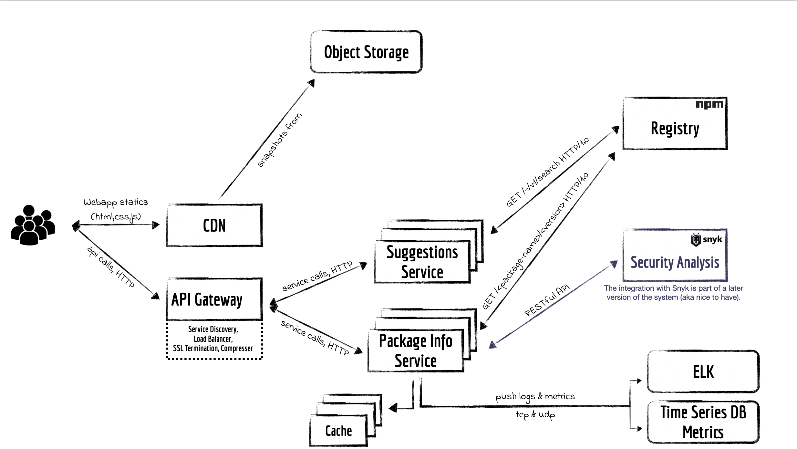

## Snyk tech exercise

This repository contains the work that was done for the Snyk tech exercise. The exercise was part of their hiring process.

Long story short, the scope of the developed solution was to fetch the overall dependencies for a specific NPM package and display them in a tree view.

## Solution architecture

## Useful links

1. [System Design Doc](docs/early-design.md)
1. Solution:
    - [Web application](webapp)
    - [Micro services](services)

## Prerequisites

If you plan to run this project on your machine, please refer to the [Prerequisites](PREREQUISITES.md) first.