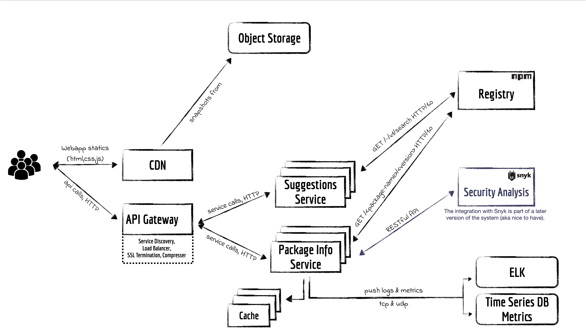

## Introduction

This service should return the full package dependency tree based on a given package name (user input), applicable in the NodeJS ecosystem via the NPM.

## Requirements and goals of the system

**Functional:**

1. Given the name of a published npm package, the system must return the entire set of dependencies for the package.
1. The results must be presented in a tree view.
1. The data should be cached in order to improve the overall latency of the system.

**Non-functional:**

1. The system should be reliable and tested.
1. The tree view should be displayed fast, with low latency.
1. Asynchronicity of the operations should be in place.

**Extended requirements:**

1. The fetched dependencies should be compared with Snyk's database of vulnerable packages in order to identify whether any of the dependencies are vulnerable.
1. For any package that is identified as vulnerable, the system should list all available remediation paths (upgrades and/or patches for vulnerable packages) for the user.
1. The user chooses their preferred remediation actions from the list presented by the above step, and the system should apply them by creating a PR for the relevant code repository.

## Capacity estimation and constraints

The system is a read-heavy one. No writes are involved in its early stage.

Currently, Snyk has __2.2M__ active customers. We will double up this number to __4M__ and compute the estimates on a daily basis where applicable (the doubling of the number will help us handle future unexpected peaks).

The check for vulnerabilities in the dependencies usually happens before each production release. Lets suppose the Snyk customers threat each commit as a release candidate and they have __5 daily checks__ for their dependencies.

To sum up we have: __4M daily active customers__ having, on average, __5 daily checks__ for their dependencies.

**Traffic estimates:** Assuming we have 4M daily users x 5 daily check this results in:

5 x 4M => 20M daily interactions

What would be the "Queries Per Second" (QPS) indicator for our system?

20 million / (24 hours * 3600 seconds) = ~232 QPS

**Storage estimates:**

At this point, our services are stateless and no persistence layer is needed. Our source of truth is the NPM registry (available at https://registry.npmjs.org/) and all the data we need we will fetch from the registry.

We will consider caching, but the estimates will be covered in sections below.

**Bandwidth estimates (income data):**

Considering the rules presented here (https://github.com/npm/validate-npm-package-name) a valid NPM package name should not exceed 214 characters.

The best case scenario in terms of package name size would be 1 and worst case 214.

We suppose the average size is a quarter of the maximum: 214 / 4 => 54.

Our context would be:

232 QPS * 54 bytes = 12528 bytes => ~ 13 KB/s

If we need a more in depth look considering headers and other stuff, lets suppose we also add:

- ~200 bytes for headers (e.g. content-type, date, cache-control, etags, http versions...)
- ~304 bytes for a JWT header

Our full payload that the system will ingest could be:

232 QPS * (54 + 200 + 304) bytes = 129456 bytes => ~ 130 KB/s

**Memory estimates:**

If we want to cache some of the hot packages that are frequently verified, how much memory will we need to store them? If we follow the 80-20 rule, meaning 20% of packages generate 80% of traffic, we would like to cache these 20% hot packages.

But first, lets see how much space is needed for storing a package in cache on average (considering top 5 most popular packages for devs - https://www.esparkinfo.com/node-js-packages.html):

- ExpressJS (https://github.com/expressjs/express/blob/master/package.json): 2705 characters + 475 spaces = 3180 characters (bytes)
- Async (https://github.com/caolan/async/blob/master/package.json): 2454 characters + 395 spaces = 2849 characters (bytes)
- Request (https://github.com/request/request/blob/master/package.json): 1999 characters + 378 spaces = 2377 characters (bytes)
- Grunt (https://github.com/gruntjs/grunt/blob/main/package.json): 1385 characters + 275 spaces = 1660 characters (bytes)
- PM2 (https://raw.githubusercontent.com/Unitech/pm2/master/package.json): 4184 characters + 1003 spaces = 5187 characters (bytes)

The average size is for a package.json: 

(3180 + 2849 + 2377 + 1660 + 5187) / 5 = 3050 bytes

Since we have 232 requests per second, we will be getting 20 million requests per day. To cache 20% of these requests, we will need 12.2 GB of memory:

0.2 * 20 million * 3050 bytes = 12 200 000 000 bytes => 12.2 GB

**High-level estimates:**

| Operation                     | Resources  |
| -----------                   |----------- |
| Active users                  | 4 million  |
| Daily scans                   | 5          |
| QPS                           | 232        |
| Inbound bandwith              | 130 KB/s   |
| Caching memory (20% rule)     | 12.2 GB    |

## API Definition

## Architectural diagram

## Load balancing

We can add a Load balancing layer at three places in our system:

1. Between Gateway and Services
1. Between Services and Cache servers

Initially, we could use a simple Round Robin approach that distributes incoming requests equally among backend servers. This LB is simple to implement and does not introduce any overhead. Another benefit of this approach is that if a server is dead, LB will take it out of the rotation and stop sending any traffic to it.

A problem with Round Robin LB is that we do not consider the server load. As a result, if a server is overloaded or slow, the LB will not stop sending new requests to that server. To handle this, a more intelligent LB solution can be placed that periodically queries the backend server about its load and adjusts traffic based on that.

In order to have a proper intelligent LB we also have do expose health check endpoints on the services.

For the gateway we will use **HAProxy**.

## Caching

We can cache the packages that are frequently accessed. We can use any off-the-shelf solution like Memcached or Redis. Thus, the services, before hitting the external systems (e.g. NPM Registry), can quickly check if the cache has the desired package considering also the version (the 'latest' version might suffer updates from time to time).

**How much cache memory should we have?** We can follow the Pareto distribution. We can start with 20% of daily traffic and, based on clients’ usage patterns, we can adjust how many cache servers we need. As estimated above, we need 12.2 GB of memory to cache 20% of daily traffic. Since a modern-day server can have 1TB of memory, we can easily fit all the cache into one machine. Alternatively, we can use a couple of smaller servers to store all these hot packages.

**Which cache eviction policy would best fit our needs?** When the cache is full, and we want to replace a package with a newer/hotter package, how would we choose? Least Recently Used (LRU) can be a reasonable policy for our system. Under this policy, we discard the least recently used package first. 

To further increase the efficiency, we can replicate our caching servers to distribute the load between them.

How can each cache replica be updated? Whenever there is a cache miss, our servers would be hitting an external system. Whenever this happens, we can update the cache and pass the new entry to all the cache replicas. Each replica can update its cache by adding the new entry. If a replica already has that entry, it can simply ignore it.

## Observability (logs, metrics)

For monitoring our system we can use 2 directions: implementing logs and configuring metrics.

The logs mainly will help us with debugging issues, if any, in production.

The metrics will help us identify trends, trigger alerts in case of failures or generate various statistics about the platform.

For the logs we will use the classic ELK stack (ElasticSearch, Logstash & Kibana).

For the metrics we will use StatsD along with the combination of Graphite (timeseries db) and Grafana (UI for dashboards/queries).

## Future design considerations

- Integration with Snyk and vulnerability scan
- Replication of NPM Registry for faster searches (via https://replicate.npmjs.com and the follower pattern)
- Bots for different code versioning platforms for auto PRing and patching the vulnerable dependencies